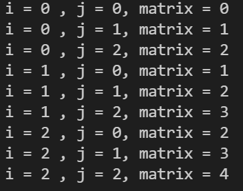
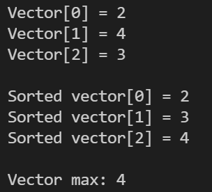

# Exercise

Hallo Leute!

Willkommen bei der nächsten Programmier-Übung in diesem Kurs.

## Aufgaben der Programmierübung

## Aufgabe 1

Definiert (typedef) einen 2d-Vector mit dem Namen Matrix, der vom Datentyp double ist.  
Initialisiert eine 3x3 Matrix in der Main Funktion, mit den Wert (i + j) an dem index matrix[i][j].

### Beispiel Aufgabe 1



## Aufgabe 2

Schreibt eine Funktion

```cpp
vector<double> max_row_values(Matrix &matrix);
```

die eine Matrix entgegennimmt und die Zeilenmaxima der Matrix berechnet und diese Maximima in einen neuen Vector abspeichert.Diesen neuen erstellten Vector returned die Funktion dann.

### Beispiel Aufgabe 2


## Aufgabe 3

Schreibt eine Funktion

```cpp
double sort_and_max(vector<double> &vec);
```

die einen Double-Vector entgegennimmt und diesen aufstiegend sortiert und zusätzlich das Maximum des Vektors zurückgibt.

### Beispiel Aufgabe 3



## Hinweise

Der Udemy Compiler überprüft nur, ob ihr eine Lösung abgegeben habt.  
Meine Musterlösung werde ich im folgenden Video vorstellen.
