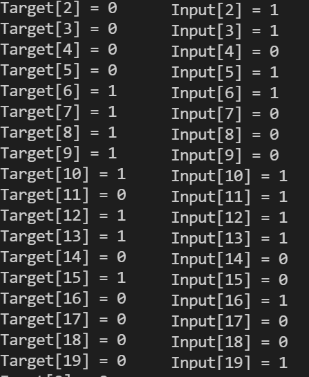
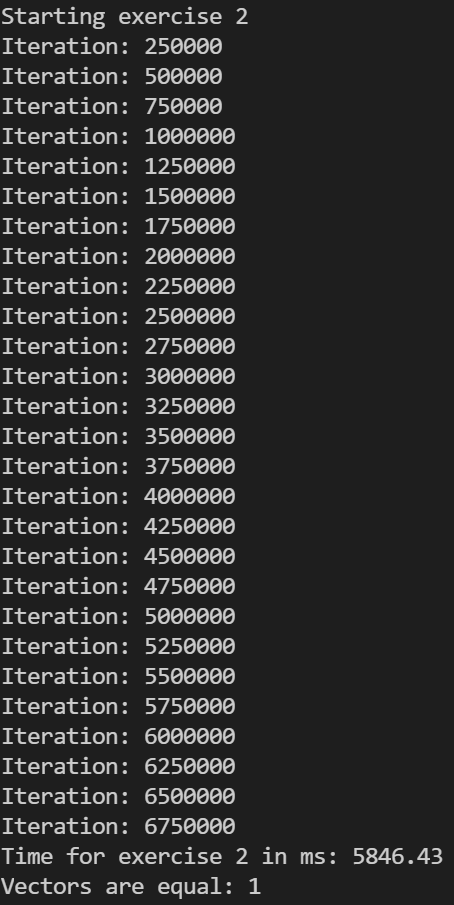

# Exercise

Hallo Leute!

Willkommen bei der nächsten Programmier-Übung in diesem Kurs.

## Aufgaben der Programmierübung

### Aufgabe 1

Erstellt einen binären Zufallsvektor "target" in der Main Funktion, mit einer Länge von 20 Elementen.  
Permutiert die Werte des Vektors und speichert diese in einem neuen Vektor "input" ab.

Mit der folgenden Verteilung können Vektoren mit ausschließlich binären Werten erstellt werden.

```cpp
// Verteilung für die Zahlen {0, 1}
std::bernoulli_distribution
```

### Beispiel Aufgabe 1

Beispiel für den erzeugten Target Vector und den "ge-shuffelten" Input Vektor.



### Aufgabe 2

Schreibt eine Funktion

```cpp
vector<bool> shuffle_till_equal(const BinaryArray &target, BinaryArray input);
```

Die einen Binären Vektor "target" und einen Binären Vektor "input" entgegennimmt.Bei jeder Iteration muss überprüft werden, ob die beiden Vektoren die gleichen Werte haben.Sofern das so ist, kann die Funktion terminieren.Sofern das nicht der Fall ist, soll das (ganze) Input Arrays erneut ge-shuffelt werden.

### Beispiel Aufgabe 2



### Aufgabe 3

Jetzt wollen wir eine effizientere Version programmieren.

```cpp
vector<bool> smart_shuffle_till_equal(const BinaryArray &target, BinaryArray input);
```

Diese soll nicht immer den kompletten Vector Shuffeln, sondern nur ab dem Index, bei dem der erste unterschiedliche Wert auftaucht. (Vom Anfang des Vectors aus gesehen)Führt diese Funktion ebenfalls aus und misst ebenfalls die Zeit.

### Beispiel Aufgabe 3


## Hinweise

Der Udemy Compiler überprüft nur, ob ihr eine Lösung abgegeben habt.  
Meine Musterlösung werde ich im folgenden Video vorstellen.
