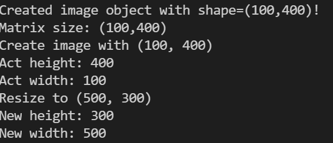
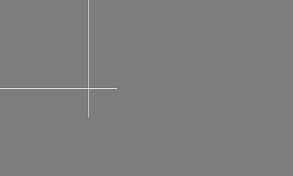

# Exercise

Hallo Leute!

Willkommen bei der nächsten Programmier-Übung in diesem Kurs.

## Aufgaben der Programmierübung

### Aufgabe 1

Schreibe eine Funktion, die den Speicher des Bildes löscht, d.h. der vector soll geleert werden.

```cpp
void clear_image();
```

### Aufgabe 2

Schreibe eine Funktion, die einen Pixel Wert an der Stelle (x,y) setzt.

```cpp
void set_pixel(const unsigned int x, const unsigned int y, const uchar value);
```

### Aufgabe 3

Schreibe eine Funktion, die die Größe des Bildes verändert, d.h. die Höhe oder Breite des Bildes wird verändert.

```cpp
void resize_image(const unsigned int new_width, const unsigned int new_height);
```

Wenn eine Dimension (Höhe oder Breite) des Bildes größer wird, soll die Matrix des Bildes mit 0 aufgefüllt werden.

### Konsolen-Output



### Aufgabe 4

Schreibe eine Funktion, die das Bild komplett mit einer Farbe füllt.

```cpp
void fill_image(const uchar value);
```

Die Füll-Farbe ist durch die Variable value gegeben.

Aufgabe 5 (Zusatzaufgabe):Schreibe eine Funktion, die eine horizontale bzw. vertikale Gerade auf das Bild malt.

```cpp
void draw_line(const unsigned int x1, const unsigned int y1, 
	           const unsigned int x2, const unsigned int y2, 
	           const uchar value);
```

### Beispiel-Bild



## Hinweise

Der Udemy Compiler überprüft nur, ob ihr eine Lösung abgegeben habt.  
Meine Musterlösung werde ich im folgenden Video vorstellen.
